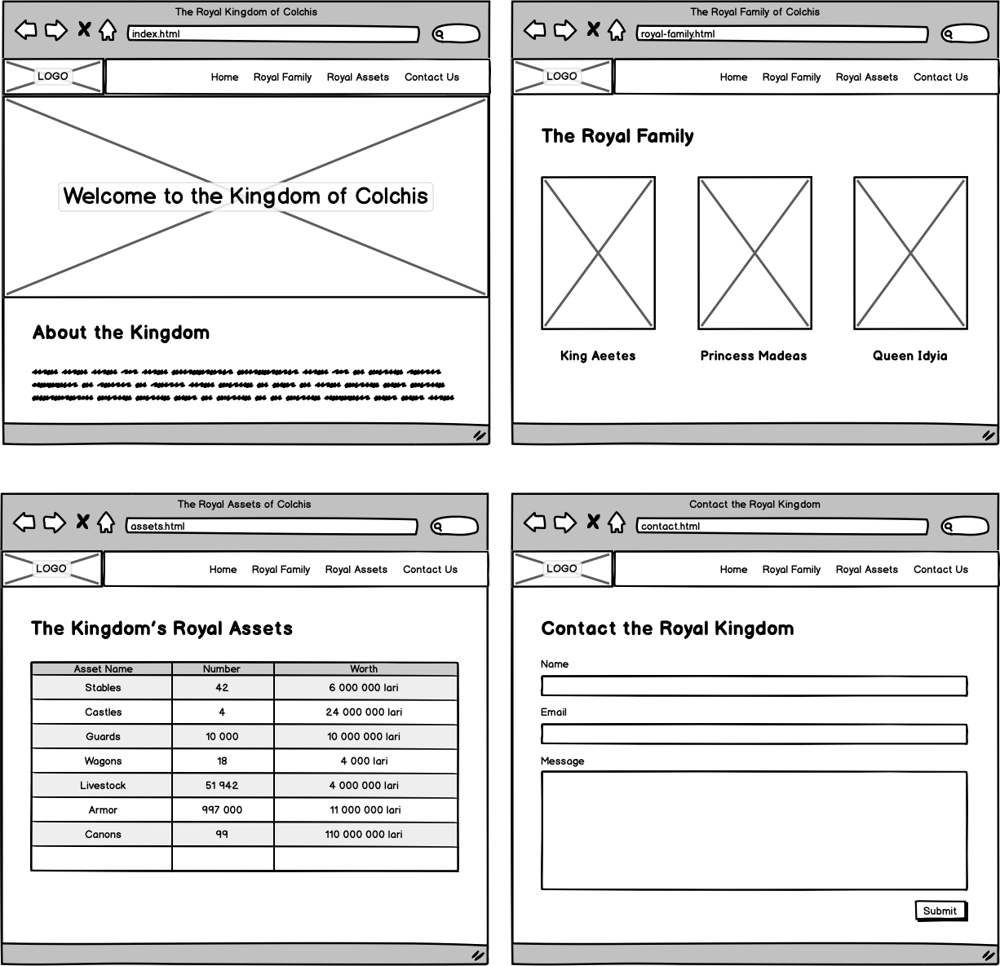

# 🚀 Tech Challenge Drylead : Créez le site du royaume

### **Contexte narratif**
Bienvenue en **Grèce antique, 6ᵉ siècle avant J.-C.**  
Dans le palais de Colchide, deux développeurs s’affairent : **Pollux** (front-end) et **Servera** (back-end).

Le roi vous a confié une mission d’importance : **créer le site officiel du royaume**.  
Vous disposez d’un équipement moderne : 50 machines et une connexion ultra-rapide grâce au **Fast Colchis Fiber Cable** ⚡.

Le grand **Demo Day** approche, et des milliers d’invités prestigieux sont attendus. À vous de briller et de démontrer vos compétences !

---

## 🎯 Votre mission
Construire un site web fonctionnel et structuré en **HTML** et **CSS** (avec un peu de JavaScript).

Vous partirez d’un squelette HTML déjà préparé dans **CodeSandbox**. Avant de commencer :
1. Créez un compte sur [CodeSandbox](https://codesandbox.io).
2. **Forkez** le projet starter pour conserver votre progression.

👉 Starter : [CodeSandbox – Drylead Tech Challenge]([https://codesandbox.io/s/techchallenge-web-dev-starter-mf0ep?file=/index.html](https://codesandbox.io/p/sandbox/n38plj))

---

## 🛠️ Fonctionnalités requises

1. **Navigation**
    - Une barre de navigation présente sur chaque page.
    - Structure en `<ul>` et `<li>`.
    - Chaque item doit pointer vers une page correspondante.

2. **Page d’accueil (index.html)**
    - Une section “héros” qui accueille les visiteurs.
    - Utilisez une image ou une couleur de fond CSS.

3. **Page “Famille royale”**
    - Présentez trois personnages principaux.
    - Positionnez-les côte à côte avec **Flexbox**.

4. **Tableau HTML**
    - Listez soit les biens du royaume, soit un calendrier d’événements.
    - Soyez créatifs dans le contenu !

5. **Page de contact**
    - Un formulaire avec `<label>` et `<input>` (bien associés via `for` et `id`).
    - Ajoutez une alerte JavaScript lors de la soumission.

6. **Qualité du code**
    - Testez vos pages sur le [validateur W3C](https://validator.w3.org/#validate_by_input).
    - Aucune erreur HTML ne doit subsister.

7. **Style et design**
    - Ajoutez une police Google Fonts.
    - Personnalisez le CSS pour donner vie au site (même simple).

---

## 💡 Conseils
- Les wireframes fournis ne sont qu’un **guide** : vous êtes libres d’être créatifs.
- Pour les visuels, privilégiez des images libres de droits ([pexels.com](https://www.pexels.com/), [pixabay.com](https://pixabay.com/)).
- Pensez à la lisibilité et à la structure du code.

---

## ✅ Soumission
À la fin, partagez le **lien de votre CodeSandbox** comme solution.

---

## 🎉 Clôture du défi
Deux jours plus tard, votre site est présenté au public. Le roi et ses invités applaudissent :

**“Quand le code est clair, l’esprit l’est aussi !”**

Vous avez gagné l’estime du royaume et montré votre savoir-faire de développeur.
